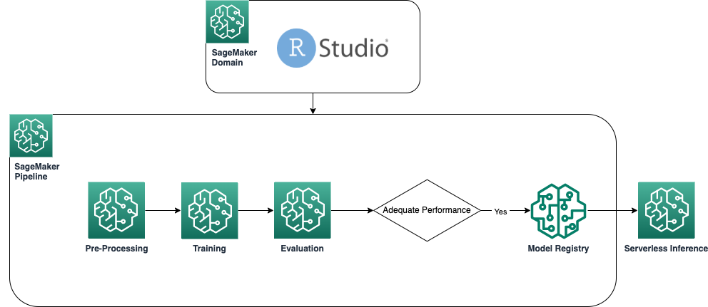

```{r setup, include=FALSE}
knitr::opts_chunk$set(echo = TRUE)
```

# Use RStudio on SageMaker to create a SageMaker Pipeline and deploy to a serverless endpoint

This is an example of using RStudio on SageMaker showing how you can create a SageMaker Pipeline with R as well as deploying your R model in a serverless endpoint. 

The following diagram shows the architecture used in this example.





This file contains the logic to run the end to end process along with comments for each of the steps.


## Folder/File Structure

- `iam_policy.json` & `trust_relationship.json` contain the additional IAM policy and trust relationship that needs to be added to your assumed role and contain the permissions you will need to use CodeBuild to build the custom R containers
- `docker/` contains the docker file definitions and helper files needed by the custom containers
- `preprocessing`, `postprocessing` and `training_and_deploying` folders container the  code for the respective steps
- `pipeline.R` is the file containing the definition of the SageMaker Pipeline. 


# Setup & preparation
To begin with, make sure you have all the necessary packages installed and initialise some variables that we will need in the next cells. 


```{r}
library(dplyr)
library(reticulate)
if (!py_module_available("sagemaker-studio-image-build")){py_install("sagemaker-studio-image-build", pip=TRUE)}
library(readr)

sagemaker <- import('sagemaker')
boto3 <- import('boto3')

session <- sagemaker$Session()
bucket <- session$default_bucket()

role_arn <- sagemaker$get_execution_role()
account_id <- session$account_id()
region <- boto3$session$Session()$region_name

local_path <- dirname(rstudioapi::getSourceEditorContext()$path)

```

## Download data

For this example we will be using the famous abalone dataset as can be found on the [UCI dataset archive](https://archive.ics.uci.edu/ml/datasets/Abalone) where we will create a model to predict the age of an abalone shell based on physical measurements.

Dua, D. and Graff, C. (2019). UCI Machine Learning Repository [<http://archive.ics.uci.edu/ml>]. Irvine, CA: University of California, School of Information and Computer Science.


```{r}
data_file <- 's3://sagemaker-sample-files/datasets/tabular/uci_abalone/abalone.csv'
data_string <- sagemaker$s3$S3Downloader$read_file(data_file)
abalone <- read_csv(file = data_string, col_names = FALSE)
names(abalone) <- c('sex', 'length', 'diameter', 'height', 'whole_weight', 'shucked_weight', 'viscera_weight', 'shell_weight', 'rings')
head(abalone)

dir.create(paste0(local_path,"/data"), showWarnings = FALSE)
write_csv(abalone, paste0(local_path,"/data/abalone_data.csv"))


s3_raw_data <- session$upload_data(path = paste0(local_path,"/data/abalone_data.csv"),
                                   bucket = bucket,
                                   key_prefix = 'pipeline-example/data')
```

We are also creating the variable `abalone_t`. This will be used for testing the endpoint is available at a later stage.
```{r}
abalone_t <- abalone %>%
  mutate(female = as.integer(ifelse(sex == 'F', 1, 0)),
         male = as.integer(ifelse(sex == 'M', 1, 0)),
         infant = as.integer(ifelse(sex == 'I', 1, 0))) %>%
  select(-sex)
```

# Build the containers
In this example, we are building our own, reusable, containers. If you are unfamiliar with this process, feel free to jump to the previous section in this repository, in 02_AdvancedSageMaker to learn more about this. 

```{r}
system(paste0("cd ", local_path, " ; sm-docker build . --file ./docker/Dockerfile-processing --repository sagemaker-r-processing:1.0"))

system(paste0("cd ", local_path, " ; sm-docker build . --file ./docker/Dockerfile-train-and-deploy --repository sagemaker-r-train-and-deploy:1.0"))
```


# Run pipeline

The pipelines is defined in the file `pipeline.R`. Head to that file to dive deeper into how a SageMaker Pipeline is being defined. To run it, we simply need to run the upsert method to create or update the pipeline and then running the start method actually starts the execution of the pipeline on SageMaker. 

To view the pipeline as it is running, head to SageMaker Studio where a custom UI will allow you to visualise the DAG of the execution of the pipeline.

```{r}
source(paste0(local_path, "/pipeline.R"))
my_pipeline <- get_pipeline(input_data_uri=s3_raw_data)

my_pipeline$definition()

upserted <- my_pipeline$upsert(role_arn=role_arn)
execution <- my_pipeline$start()
```

# Deploy to serverless endpoint
Once the pipeline has finished running, a model will be registered to the model registry and we will be able to deploy the model to an endpoint. In this example we deploy on a serverless endpoint but you are welcome to deploy with any of the supported deployment methods.

<br> 

From all approved models in the model registry, we want to select the one most recently created. We can simply query the model registry as below to get the ARN for that model. 

```{r}
approved_models <- boto3$client("sagemaker")$list_model_packages(ModelApprovalStatus='Approved', 
                                                                 ModelPackageGroupName='AbaloneRModelPackageGroup',
                                                                 SortBy='CreationTime',
                                                                 SortOrder='Ascending')
model_package_arn <- approved_models[["ModelPackageSummaryList"]][[1]][["ModelPackageArn"]]
```

For the actual deployment, we need to create the SageMaker Model and then we can use the SageMaker SDK to deploy to a serverless endpoint as per below.

```{r}
model <- sagemaker$ModelPackage(role=role_arn, 
                                model_package_arn=model_package_arn, 
                                sagemaker_session=session)

serverless_config <- sagemaker$serverless$ServerlessInferenceConfig(memory_size_in_mb=1024L, max_concurrency=5L)
model$deploy(serverless_inference_config=serverless_config, endpoint_name="serverless-r-abalone-endpoint")

```

## Perform inference on test data
Using the data in variable `abalone_t` we will perform some sample predictions using the newly deployed model to test that it is up and running and capable of giving back predictions. 

```{r}
library(jsonlite)
x = list(features=format_csv(abalone_t[1:3,1:11]))
x = toJSON(x)

# test the endpoint
predictor <- sagemaker$predictor$Predictor(endpoint_name="serverless-r-abalone-endpoint", sagemaker_session=session)
predictor$predict(x)
```


# Delete endpoint
Don't forget to delete the running endpoint once you have finished experimenting. In this case, if the endpoint remains unused, no costs will be incurred, since it is a serverless endpoint, but nevertheless it is a good practice to always shut down unused resources/endpoints at the end of experimentation. 

```{r}
predictor$delete_endpoint(delete_endpoint_config=TRUE)
```
